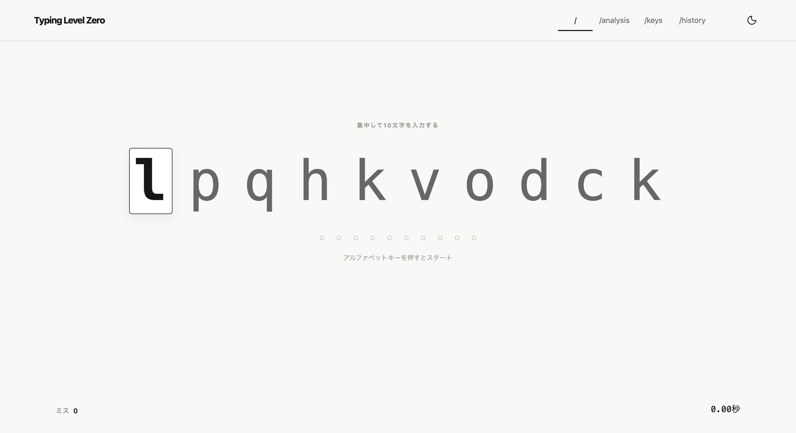
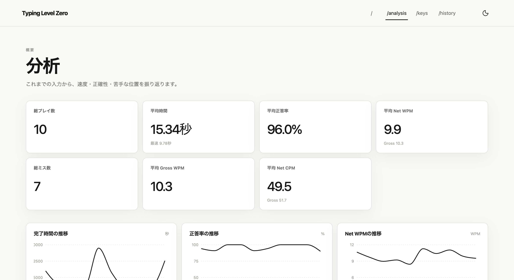
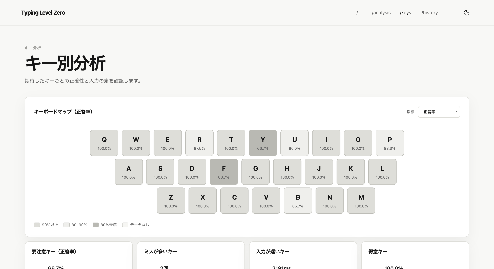

# Typing Level Zero

Try it online: <https://typing-level-zero.pages.dev/>

Typing Level Zero is a touch typing practice tool built with
Vite, React, and TypeScript. Completed plays and analysis data are kept in the
browser with IndexedDB.







## Requirements

- Node.js 20.19 or later
- pnpm 11.1.1

Install dependencies from the repository root:

```sh
pnpm install
```

## Development

Start the Vite development server:

```sh
pnpm run dev
```

The application is served from the site root.

Build and preview the production bundle:

```sh
pnpm run build
pnpm run preview
```

## Checks

```sh
pnpm run format
pnpm run lint
pnpm run test:unit
pnpm run test:e2e
pnpm run test
```

Unit tests use Vitest with a jsdom environment. Playwright runs Chromium E2E
tests against a production preview server. Tests are expected under
`tests/unit` and `tests/e2e`.
